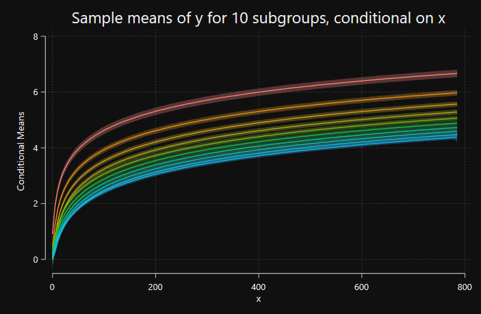

# Plot suite: makes pretty graphs pretty fast

this repository houses the most recent version of the **plot suite** of fast graphing commands for large datasets in Stata.  

 

## Instalation:

you can install the **plot suite** from SSC:

    ssc install plottabs

or from GitHub:

    net install plottabs, from("https://raw.githubusercontent.com/jankabatek/plotsuite/master/ado/") replace

Note: **plot suite needs Stata 16 or higher**.

# Description

The **plot suite** of graphing commands is particularly useful for visual analyses of admin data, enabling users to produce a variety of highly customizable plots **in a fraction of time required by Stata's native graphing commands**. Benchmarks at the bottom of this readme show that plottabs prove more than 300-times faster than the native command, with the efficiency gains growing with sample size.     

1. **plottabs** plots conditional shares/frequencies of observations (a visual analogue of 'tabulate oneway')
2. **plotshares** plots conditional categorical shares/frequencies (a visual analogue of 'tabulate twoway')
3. **plotmeans** plots conditional means (a visual analogue of *mean y, over(x)*)
4. **plotbetas** is a post-estimation command visualizing regression coefficient estimates (including factorized regressors)

Apart from speed gains, the key advantage of the **plot suite** is that it allows the user to **store multiple plot data in memory and overlay them into a single graph**. The data are stored in a very efficient manner, requiring the bare minimum of operating memory. This facilitates comparisons across groups and models, and it is likely to prove extremely handy in early exploratory stages of empirical admin data projects. For example, you can use the **plot suite** to visualize whether the dynamics of labor participation rate differ by gender or education attainment, or whether the magnitudes of your regression coefficient estimates differ between the candidate model specifications. 

In contrast to the alpha-version released as a part of the deprecated [statapack repository](https://github.com/jankabatek/statapack), the overhauled commands make nicer graphs, are easier to customize (you can specify the preferred graph type and use all of the standard twoway graphing options), and the plotted data are easier to manage (for details, see the help files in Stata).

# Examples
## Example 1: Conditional frequencies with plottabs

This example is equivalent to combining two histograms with discrete bin widths and option *freq*. 
 

Code:

    webuse set https://www.jankabatek.com/datasets/
    webuse plotdata, clear
    // optional customized schemes:
    ssc install schemepack
    // first histogram (gr=1), option clear erases previous plot data from the memory
    plottabs if gr==1, over(x1) graph(bar) clear color("0 91 187%50")
    // second histogram (gr=2), overall twoway options & graph-specific options
    plottabs if gr==2, over(x1) graph(bar) title("Frequencies of observations, conditional on x") xtitle("x") legend(on order(1 "Group 1" 2 "Group 2")) xsize(7) color("255 213 0%70") lcolor("187 151 4") scheme(gg_tableau)

## Example 2: Conditional means with plotmeans

This example plots conditional means of variable *y* (*x* is the conditioning variable) for ten groups of observations.
 
 

Code:

    webuse set https://www.jankabatek.com/datasets/
    webuse plotdata, clear
    // conditional means for the first group (gr10=1), option clear erases previous plot data from the memory
    plotmeans y if gr10 ==1, over(x2) clear 
    // conditional means for the other groups, specify the twoway options & graph options
    forvalues g = 2/10{
        plotmeans y if gr10 ==`g', over(x2) legend(off) ytitle(y) xtitle(x) title("Sample means of y for `g' subgroups," "conditional on x") xsize(6) scheme(black_hue)
    }

## Example 3: Stacked conditional shares with plotshares

This example plots how many observations belong to each of four mutually exclusive groups of observations, conditional on a specific value of *x*
 
 

Code:

    webuse set https://www.jankabatek.com/datasets/
    webuse plotdata, clear
    plotshares gr4, over(x3) title("Shares of observations belonging to groups 1-4," "conditional on x") xtitle("x") legend(on rows(4) pos(3) order(1 "Group 1" 2 "Group 2" 3 "Group 3" 4 "Group 4")) xsize(7) scheme(rainbow)

## Example 4: Multiple sets of coefficient estimates with plotbetas

This example plots coefficient estimates and 95% confidence intervals corresponding to a factorized regressor *x* from three separate regressions. 
 
 

Code:

    webuse set https://www.jankabatek.com/datasets/
    webuse plotdata, clear
    // regression model 1
    reg z1 i.x3
    plotb i.x3, clear color("250 15 92")
    // regression model 2
    reg z2 i.x3
    plotb i.x3, color("83 205 246")
    // regression model 3
    reg z3 i.x3
    plotb i.x3, title(Comparing coefficient estimates from three regression models) xtitle("Value of factorized regressor x") ytitle("Coefficient estimate") legend(on rows(1) pos(6) order(1 "1st coeff.set" 3 "2nd coeff.set" 5 "3rd coeff.set")) xsize(6.5) scheme(white_tableau) times(0.9) color("139 71 73")

## Benchmarks against a native Stata graphing command

I ran a few benchmark tests in which I pitted the plottabs command against its native counterpart, 'twoway (histogram)', with an increasingly large sample size. The efficiency gains were so large that the only sensible way to plot their relative computation times was using the logarithmic scale. At 240M observations, plottabs proved 300-times faster than twoway histogram. 

 
 

 
### Log-file, 240M observations:

    . // Log file, run with Stata 17.0, OS Windows 10. 
    . webuse set https://www.jankabatek.com/datasets/
    . webuse plotdata, clear 
    . ssc install tictoc
    . expand 3000 

    . // plottabs command
    . tic
    . plottabs if gr==1, over(x1) clear nodraw
    1 - tabulating values for a new graph
      - plot type: line
    . plottabs if gr==2, over(x1) graph(bar) 
    2 - tabulating values for a new graph
      - plot type: bar
    . toc
    Elapsed time: 0.5023 mins

    . // Twoway native command
    . tic
    . twoway (histogram x1 if gr==1, discrete) (histogram x1 if gr==2, discrete)
    . toc
    Elapsed time: 147.2696 mins
